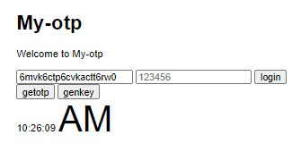
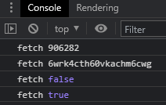

# my-otp

- 갑자기 otp가 만들고 싶어서 프로젝트 생성!
- 참고 ; https://www.youtube.com/watch?v=VOYxF12K1vE



## 기능

- 30초 간격으로 토큰 생성
- 최대 1분 동안 유효한 토큰
- 토큰 갱신 직후 30초 동안은 바로 직전 토큰도 유효

## 실행

```sh
npm i
npm start
```

## 사용 방법

- 첫 번쨰 인풋은 공유키
- 두 번째 인풋은 토큰 (유저들이 얻어서 입력하는 값)
- 키를 다르게 하면 입력해야 하는 토큰도 달라짐
- `getotp` 버튼을 눌러 현재 키에 대한 토큰을 얻기
- `genkey` 버튼을 눌러 새로운 키 생성
- `login` 버튼을 눌러 유효성 검사



- 결과는 F12 개발자 도구 콘솔에서 확인 가능

---

## Unix Epoch Time (Unix Time) 구하기

- [Unix Epoch Time ; 1970년 1월 1일 00:00:00 협정 세계시(UTC) 부터의 경과 시간을 초로 환산하여 정수로 나타낸 것이다.](https://ko.wikipedia.org/wiki/%EC%9C%A0%EB%8B%89%EC%8A%A4_%EC%8B%9C%EA%B0%84)

```js js
new Date().getTime(); // unix time
```

## N 구하기

```js js
const ts = 30; // 30초 간격으로 토큰을 생성할 것
let N = Math.floor(new Date().getTime() / (ts * 1000));
```

- unix time에서 토큰 생성간격 ts 만큼을 나누고 소수점은 버려서 N을 구한다.

## N 16진수 변환

```js js
let N_hex = ('000000000000000' + N.toString(16)).substr(-16); // 16자리가 되도록 앞에 0 패딩추가
```

- N을 16진수로 변환하는데 16자리가 되도록 처리

## m 구하기 (시간 베이스 메세지 값)

```js js
let m = Buffer.from(N_hex);
```

- N_hex를 byte array로 변환

## K 생성하기 (K : 공유키)

```js js
const base32 = require('base32'); // base32 모듈 임포트
const { randomBytes } = require('crypto');

const random12 = randomBytes(12 / 2).toString('hex'); // 12자리 랜덤 문자열 생성

const K = base32.encode(random12);
```

- 랜덤값으로부터 20자리의 공유키 K 구하기
- base32 모듈 설치
- Math.random()으로 생성한 랜덤값을 12자리 문자열로 변환하고 base32인코딩하면 20자리의 문자열을 얻을 수 있음.

## HMAC hash 얻기

```js js
const crypto = require('crypto');

let hmac_hash = crypto.createHmac('sha1', K).update(m).digest('hex');
```

- 내장 모듈 crypto 에서 hmac hash를 얻을 수 있다.

## OTP 생성

```js js
const offset = parseInt(Number(`0x${hmac_hash[hmac_hash.length - 1]}`), 10);

// offset으로부터 4개 바이트 변환
const token_hex_4bytes = hmac_hash.substring(offset * 2, offset * 2 + 4 * 2);
let toekn_hex = '';

toekn_hex += (
  '00' + (Number(`0x${token_hex_4bytes.substring(0, 2)}`) & 0x7f).toString(16)
).substr(-2);

for (let index = 2; index < token_hex_4bytes.length; index += 2) {
  const element = token_hex_4bytes.substring(index, index + 2);
  toekn_hex += ('00' + (Number(`0x${element}`) & 0xff).toString(16)).substr(-2);
}

const token = Number(`0x${toekn_hex}`).toString().substr(-6);
console.log(`token : ${token}`);
```

- hmac_hash의 맨 마지막값을 offset으로 한다
- hmac_hash offset부터 4바이트를 추출한고
- offset 바이트에 `& 0x7f` 이진 연산 수행
- 나머지 3개 바이트에 대해 `& 0xFF` 연산 수행
- 6자리 토큰을 만든다고하면 그 결과의 뒤에서 6자리를 토큰으로 한다.
